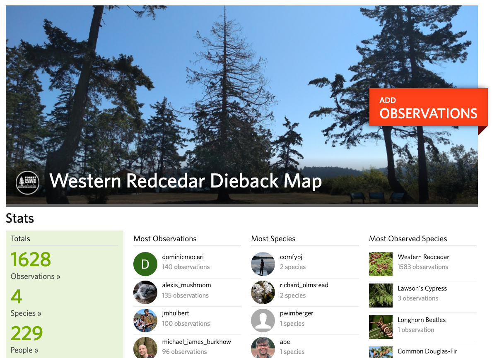

|            |            |            |            |
|:----------:|:----------:|:----------:|:----------:|
|[Home](https://jmhulbert.github.io/redcedar)|[Data Wrangling](./data-wrangle/Data-Wrangle-v1.html)|[Data Analyses](./analyses/)|[Data Visualization](./data-visualization/)|
|             |           |            |            |

# Welcome

Welcome to the github page for the [repository](https://github.com/jmhulbert/redcedar) of Western Redcedar Dieback Map analyses. Below you will find instructions for contributing to, or reproducing, the analyses of the [Western Redcedar Dieback Map](https://www.inaturalist.org/projects/western-redcedar-dieback-map) data.

## Western Redcedar Dieback Map

{width=50%}  

***

The below analyses were *only* possible because more than 200 incredible community scientists shared observations of western redcedar on iNaturalist.

***

# Purpose

The purpose of this webpage/repository is to ensure the reproducibility of the analyses conducted with data collected in the [Western Redcedar Dieback Map](https://www.inaturalist.org/projects/western-redcedar-dieback-map) project. 

# Approach

Here we model empirical data collected by community scientists (via iNaturalist) with ancillary environmental data (climate, topographic, and soils) to identify important predictors of western redcedar dieback.

Anyone is welcome to collaborate in the analyses of these data. Please contact [JM Hulbert](https://github.com/jmhulbert) at [hulbe@wsu.edu](mailto:hulbe@wsu.edu) if you're interested in contributing.

***

# Approach Reproduction Instructions

### Data Wrangling

* [Overview](./data-wrangle/Data-Wrangle-v1.html)
  + iNat Data
  + Environmental Data
    + [Climate Data](./data-wrangle/climate/Climate-Data-Extraction.html)
    + [Topography Data](./data-wrangle/topo/Topo-Data-Extraction---ArcGIS.html)
    + [Soils Data](./data-wrangle/soils/Soil-Data-Extraction.html)
  + Combined Data  

### Analyses 

* [Overview](./analyses/)
  + [iNat Data](./analyses/inat/iNat-Data-Analysis.html)
  + Environmental Data
    + Climate Data
      + [Reclassified Symptom Response](./analyses/climate/Climate-Data-Analysis---filtered-symptom-response.html)
      + [Binary Symptom Response](./analyses/climate/Climate-Data-Analysis---binary-symptom-response.html)
      + [Unhealthy Tree Number Response](./analyses/climate/Climate-Data-Analysis---unhealthy-tree-number-response.html)
    + [Topography Data](./analyses/topo/Topo-Data-Analysis.html)
    + [Soils Data](./analyses/soils/Soils-Data-Analysis.html)
  + [**Combined Analyses**](./analyses/Full-Environmental-Predictor-Analyses.html)

### Data Visualization

* [Overview](./data-visualization/)
  + [iNat Data](./data-visualization/inat/iNat-Data-Visualization.html)
  + Environmental Data
    + [Climate Data](./data-visualization/climate/Climate-Data-Visualization.html)
    + [Topography Data](./data-visualization/topo/Topo-Data-Visualization.html)
    + [Soils Data](./data-visualization/soils/Soils-Data-Visualization.html)

### Get Involved

Learn more about the methods to accelerate this research at the [Forest Health Watch](https://foresthealth.org/) website.

***

#### Contact

These analyses were prepared by Joey Hulbert, Washington State University. 

Contact Joey at [hulbe@wsu.edu](mailto:hulbe@wsu.edu)

{width=50%} 